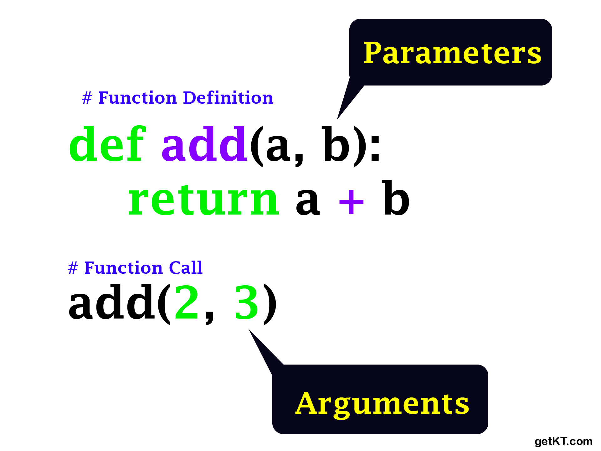

# [Detail Topics OF Javascript](../README.md)


## Basic Programming

```JavaScript
  function example(parameter){
    console.log(parameter)
  }

  const argement = "demo"

  example(argement)
```




